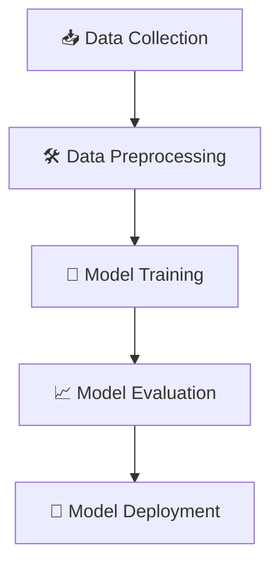

# 🏥 Thyroid Prediction Model  

## 📌 Overview  
This project is a **basic machine learning model** for **thyroid disease prediction**, achieving **97% accuracy** using **logistic regression**. The dataset was sourced from **Kaggle**, and the workflow includes **data preprocessing, model training, and implementation**.  

## 🚀 Technologies & Libraries Used  
🔹 **Python** – Programming Language  
🔹 **pandas** – Data Manipulation  
🔹 **NumPy** – Numerical Operations  
🔹 **scikit-learn** – Machine Learning Model  

## 📊 Workflow  

## 🔬 Steps Involved  
1️⃣ **Dataset Collection** – Kaggle thyroid dataset  
2️⃣ **Data Preprocessing** – Cleaning, Feature Selection, Normalization  
3️⃣ **Model Training** – Logistic Regression implementation  
4️⃣ **Evaluation** – Measuring model accuracy and performance  
5️⃣ **Deployment** – Making predictions  

## 🎯 Model Performance  
✔️ **Accuracy:** 97%  

